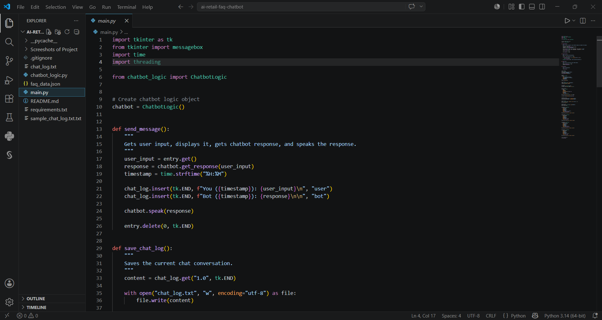

# AI Retail FAQ Chatbot

A simple Python desktop chatbot designed to answer common in-store customer questions in a retail environment.

## Project Background

This project was developed as a beginner-friendly retail customer service chatbot. The main purpose of the chatbot is to simulate how a smart retail environment can support customers by answering common questions quickly and clearly.

The chatbot can answer questions about store hours, location, return policy, payment methods, parking, delivery, and gift cards. The FAQ data is stored in an external JSON file, which makes it easier to update the questions and answers without changing the main Python code.

## Project Overview

The application uses a desktop graphical user interface built with Tkinter. Users can type a question into the input box, and the chatbot responds based on keyword matching from the FAQ data.

The project has been structured in a modular way. The main interface is handled in one file, while the chatbot logic is handled separately. This makes the program easier to understand, maintain, and improve in the future.

## Features

- Desktop GUI built with Tkinter
- Modular Python structure
- FAQ data stored in JSON format
- Keyword-based response matching
- Text-to-speech response using the Windows speech system
- Repeated question detection
- Timestamped chat messages
- Chat log saving
- Clear chat button
- Exit button
- Beginner-friendly code structure

## Technologies Used

- Python
- Tkinter
- JSON
- Windows PowerShell speech system
- File handling
- Modular programming

## Project Structure

```text
ai-retail-faq-chatbot/
├── main.py
├── chatbot_logic.py
├── faq_data.json
├── sample_chat_log.txt
├── requirements.txt
├── .gitignore
└── README.md
```

## File Descriptions

| File | Description |
|---|---|
| `main.py` | Runs the graphical user interface and handles user interaction |
| `chatbot_logic.py` | Contains the chatbot response logic, memory system, and speech function |
| `faq_data.json` | Stores FAQ keywords and chatbot responses |
| `sample_chat_log.txt` | Example chat log file |
| `requirements.txt` | Lists required packages, if any |
| `.gitignore` | Prevents unnecessary files from being uploaded |
| `README.md` | Explains the project |

## How to Run

1. Make sure Python is installed on your computer.

2. Open the project folder in VS Code or another code editor.

3. Run the application:

```bash
python main.py
```

## Example Questions

You can ask questions such as:

```text
store hours
location
return policy
credit card
gift card
parking
delivery
```

## Example Behaviour

If the user asks:

```text
return policy
```

The chatbot may respond with the store’s return policy.

If the user asks the exact same question again, the chatbot detects it and replies:

```text
You've already asked this question. Would you like to ask something else?
```

## What I Learned

Through this project, I practised Python GUI development, modular programming, JSON file handling, simple chatbot logic, keyword matching, text-to-speech integration, file handling, and basic user interaction design.

This project also helped me understand how a simple chatbot can be used in a retail environment to improve customer service and reduce repetitive questions for staff.

## Future Improvements

- Add more FAQ categories
- Improve keyword matching
- Add voice input
- Create a web-based version
- Improve the graphical interface
- Connect the chatbot to a real retail database
- Add multilingual support
- Add more advanced natural language processing

## Screenshots

### Final Chatbot Interface


### Modular Code Structure


### FAQ JSON Data
